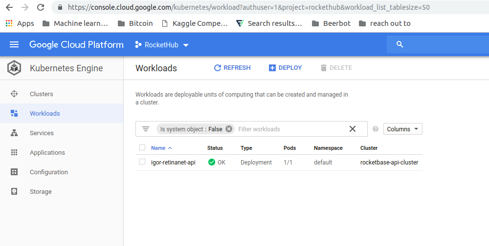
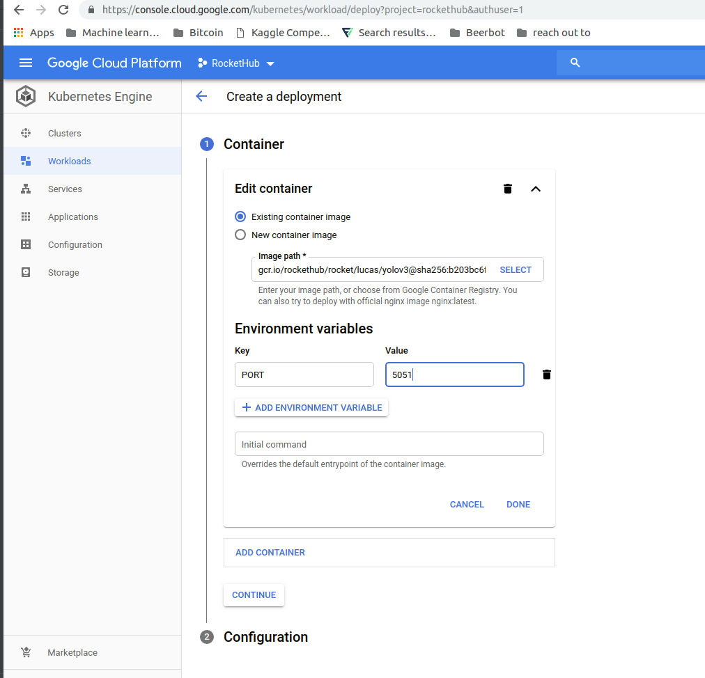
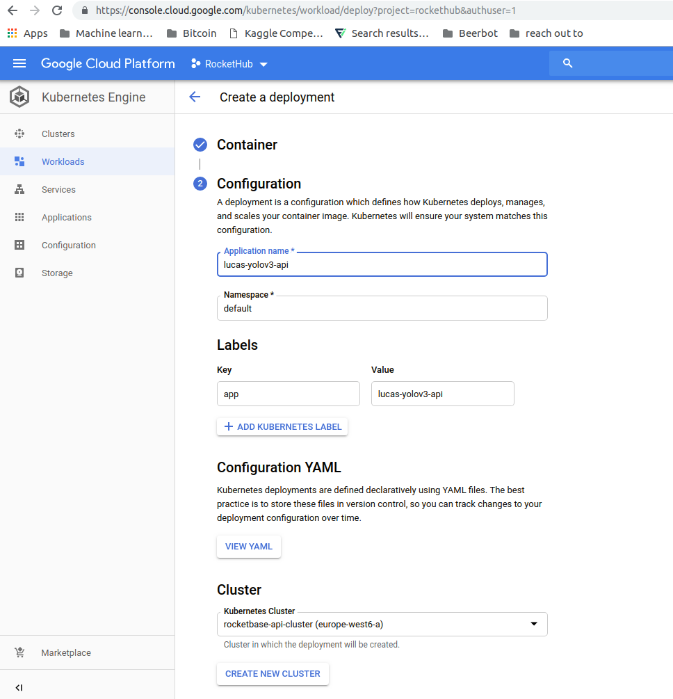
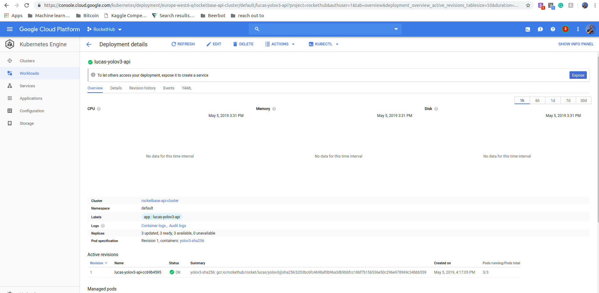
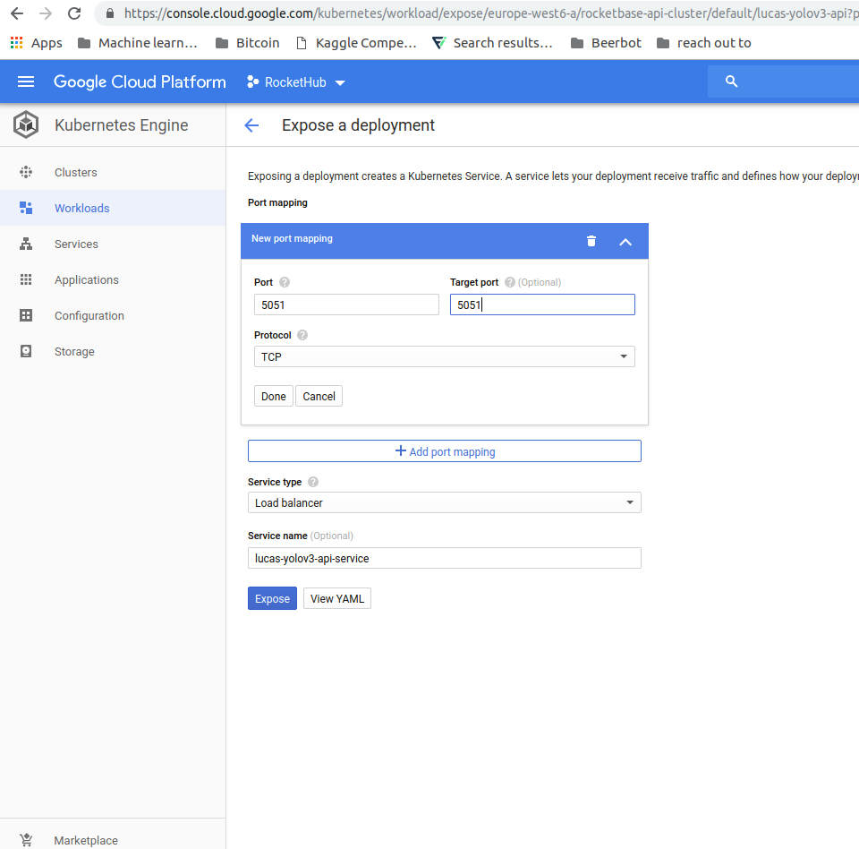
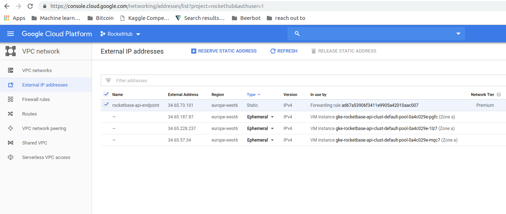
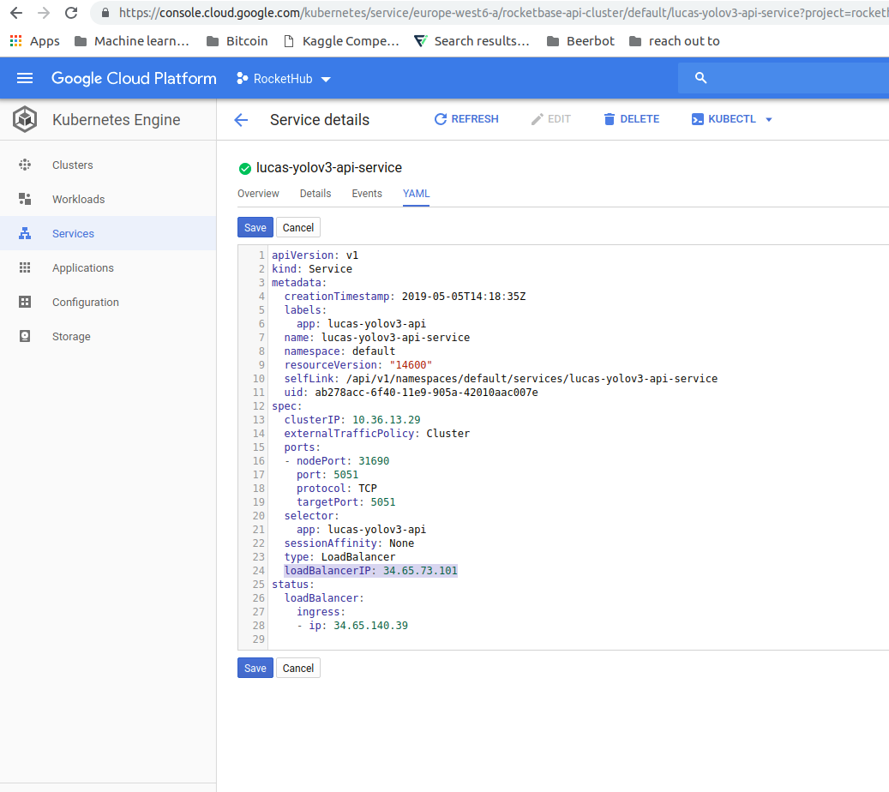

### Description
This Repository contains everything needed to host rockets inside a docker container. The [flask](http://flask.pocoo.org) server is created
in `app/app.py`. The whole code is inspired by [fastaiv3 deployment using render](https://github.com/render-examples/fastai-v3).

You need not to touch/code at all. All relevant settings can be done using a `config.ini` file. 
A template is provided to you in `config-example.ini`. 

The file looks like this:
``` ini
; config-example.ini
[DEFAULT]
DEVICE = cpu
ROCKET_URL = lucas/yolov3
PORT = 5042
```

You can change the desired `device` as well as `rocket` and the `port`. The `port` will however only be used for local
testing. Google Cloud Run will give it another port automatically.

### Build and Run the docker container

**Replace `DOCKER_IMAGE_NAME` with the appropriate rocket name and version tag.**

e.g. `DOCKER_IMAGE_NAME:TAG` can be something like `yolov3:0.1`


Build the docker container:
`docker build --tag DOCKER_IMAGE_NAME:TAG .`

You should see the new container by calling:
`docker image list`

You can run the container using:
`docker run -p 5042:5042 DOCKER_IMAGE_NAME:TAG`

With `curl -X POST -F input=@office.jpg https://DOCKER_IMAGE_NAME-x7lr346vxq-uc.a.run.app/process` you can make a request to the new endpoint for json response.

For endpoints returning an image (e.g. style transfer) you can save the returned image to a file using: `curl -X POST -F input=@office.jpg https://DOCKER_IMAGE_NAME-x7lr346vxq-uc.a.run.app/process > out.png`

If you get the expected response everything went fine so far.

Make several calls (also in parallel). Requests will be handled using an asynchronous execution.

Open another terminal and run `docker stats` to monitor memory consumption of the container.
The amount of memory consumed will be important for creating the Google Cloud Run instance.


### How to deploy

Now we have to tag the docker image for the google cloud engine:
`sudo docker tag DOCKER_IMAGE_NAME:TAG gcr.io/rockethub/DOCKER_IMAGE_NAME:TAG`

**We use the following convention for image name:** `rocket/userName/model`

*e.g. `docker tag lucas/yolov3:0.1 gcr.io/rockethub/rocket/lucas/yolov3:0.1`*

And finally, we can push the docker image to the cloud
`docker push gcr.io/rockethub/DOCKER_IMAGE_NAME:TAG`

*e.g. `docker push gcr.io/rockethub/rocket/igor/retinanet:0.1`*


#### Use Kubernetes to deploy the container

**Step 1:**

Go to the GKE (Google Kubernetes Engine) on google cloud. Click on `Workloads` in the left menu.



**Step 2:**

Click on `deploy` to deploy a new container.

Select a container. All containers should be in `rocket/...` with a version tag. 
Select a port for the flask endpoint using an env key. Make sure you use an unused port. You can go to `Services` menu on the left to see an overview of the endpoints.



**Step 3:**

Give your application a name. Usually, we use something like `userName-model-api`
Finish the deployment.



**Step 4:**

Now we have a workload. We need to expose it to make it reachable from the web. Click on the `expose` notice on the top.




**Step 5:**

Make sure you forward the right ports. We have a http server so we use the `TCP` protocoll.



**Step 6:**

Now we need to change the IP of the loadbalancer of the service to make sure we have all the rockets on the same endpoint.
First, we need to find the IP address. You can find it under `VPC Network` on Google Cloud. The `rocketbase-api-endpoint` is our api endpoint.
Copy the IP address.



**Step 7:**

Now go back to the GKE and the `Services`. Click on the new Rocket. Click on `Edit` on the top menu.
We add now the `loadBalancerIP` to the YAML file under the `spec` group as shown in the picture. Make sure
the IP address matches the one from the `rocketbase-api-endpoint`.



