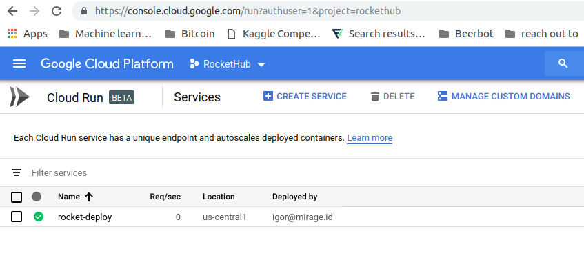

### Description
This Repository contains everything needed to host rockets inside a docker container. The [starlette](https://www.starlette.io/) server is created
in `app/app.py`. The whole code is inspired by [fastaiv3 deployment using render](https://github.com/render-examples/fastai-v3).

You need not to touch/code at all. All relevant settings can be done using a `config.ini` file. 
A template is provided to you in `config-example.ini`. 

The file looks like this:
``` ini
; config-example.ini
[DEFAULT]
DEVICE = cpu
ROCKET_URL = lucas/yolov3
PORT = 5042
```

You can change the desired `device` as well as `rocket` and the `port`. The `port` will however only be used for local
testing. Google Cloud Run will give it another port automatically.

### Build and Run the docker container

**Replace `DOCKER_IMAGE_NAME` with the appropriate rocket name and version tag.**

e.g. `DOCKER_IMAGE_NAME:TAG` can be something like `yolov3:0.1`


Build the docker container:
`docker build --tag DOCKER_IMAGE_NAME:TAG .`

You should see the new container by calling:
`docker image list`

You can run the container using:
`docker run -p 5042:5042 DOCKER_IMAGE_NAME:TAG`
With `curl -X POST -F input=@office.jpg https://DOCKER_IMAGE_NAME-x7lr346vxq-uc.a.run.app/process` you can make a request to the new endpoint.
If you get the expected response everything went fine so far.

Make several calls (also in parallel). Requests will be handled using an asynchronous execution.

Open another terminal and run `docker stats` to monitor memory consumption of the container.
The amount of memory consumed will be important for creating the Google Cloud Run instance.


### How to deploy

Now we have to tag the docker image for the google cloud engine:
`sudo docker tag DOCKER_IMAGE_NAME:TAG gcr.io/rockethub/DOCKER_IMAGE_NAME:TAG`

And finally, we can push the docker image to the cloud
`docker push gcr.io/rockethub/DOCKER_IMAGE_NAME:TAG`


Use Google Cloud Run for starting the container:


1. Create a new service
2. Select the just pushed docker image
3. ***TEMPORARY HACK: Allow unauthenticated invocations***
4. Increase the amount of memory based on your findings

